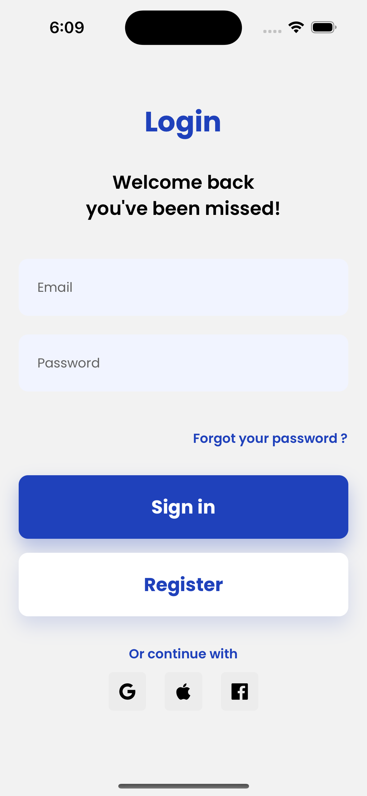
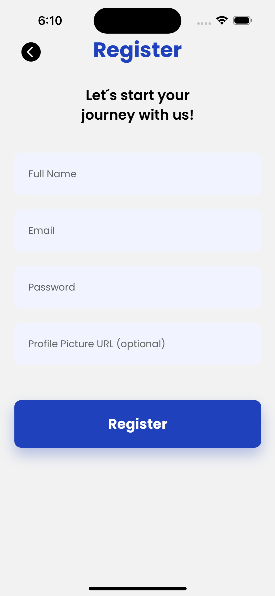
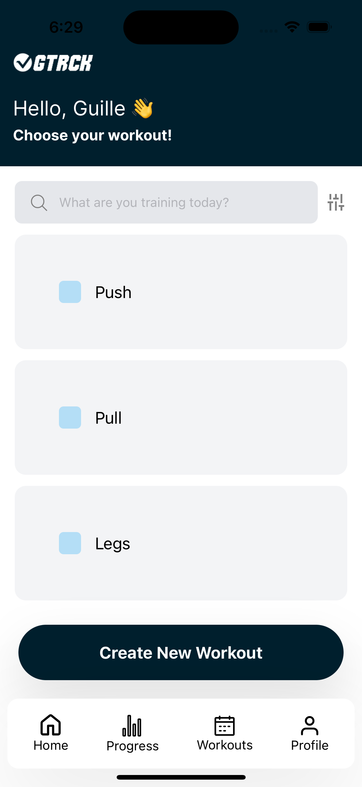
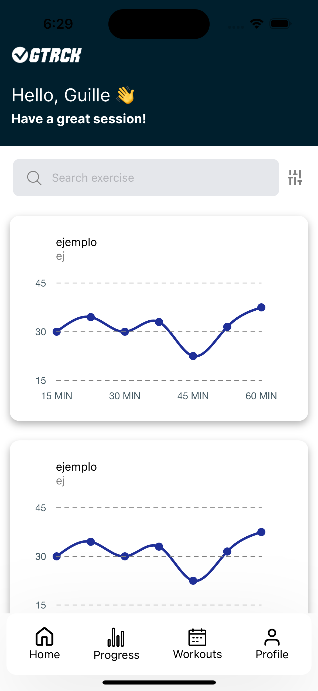
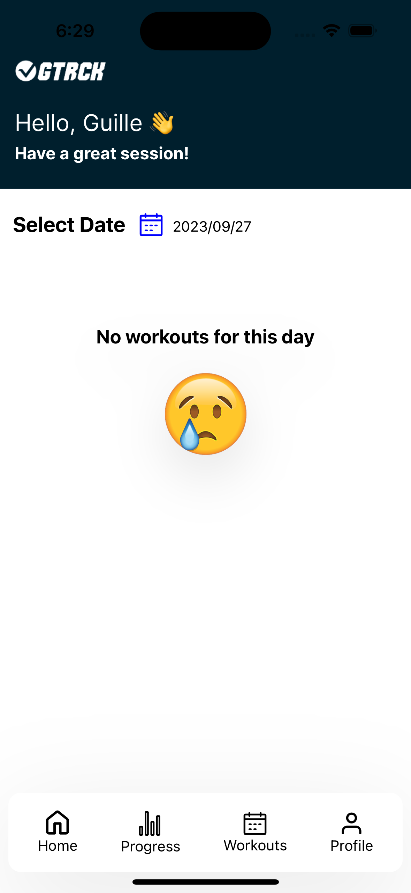
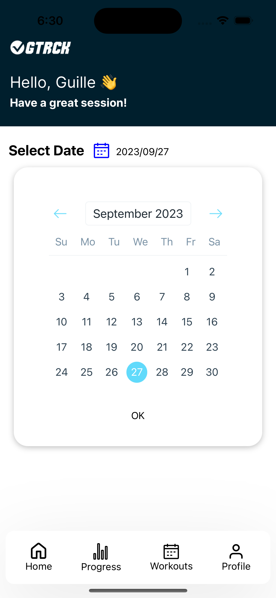
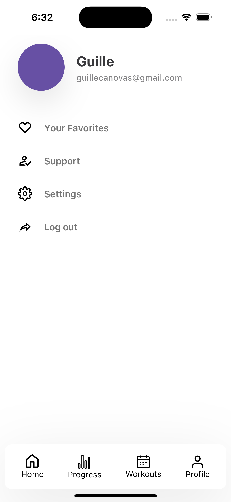
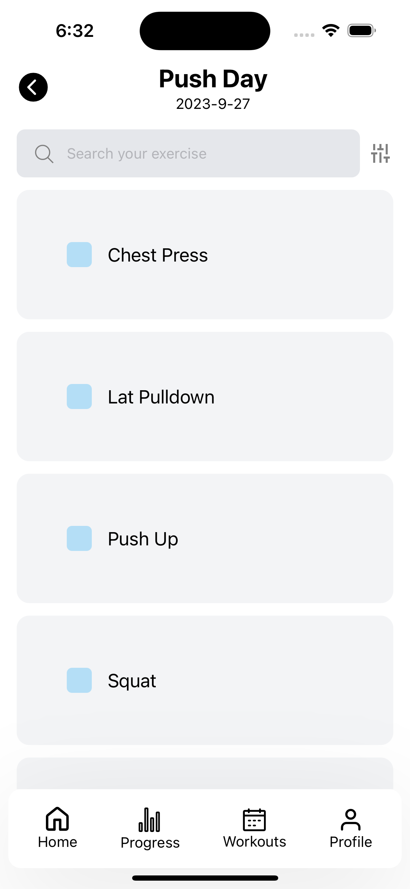
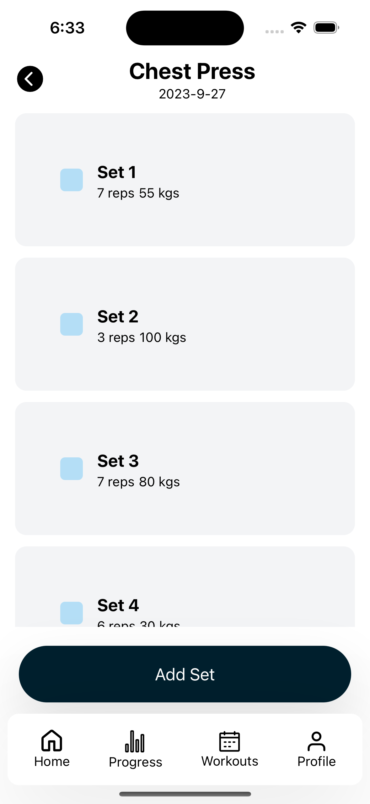
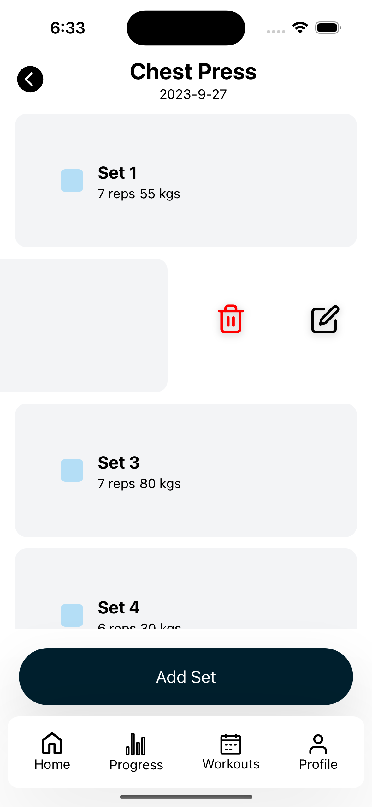

# gym-tracker-app

The Weightlifting Tracker App is a React Native application designed to help users keep track of their weightlifting sessions. It allows users to record their weightlifting activities during each workout session, visualize their progress for each exercise, and access a history of past lifting sessions. The app is a valuable tool for both novice and experienced weightlifters looking to monitor their fitness journey.

## Features

- **Workout Logging**: Easily log your weightlifting exercises, including details such as exercise type, sets, reps, and weight lifted.

- **Exercise Progress Visualization**: Visualize your progress over time for each exercise with interactive charts and graphs.

- **Session History**: Access a comprehensive history of your past weightlifting sessions to track your long-term progress.

- **User-Friendly Interface**: The app offers an intuitive and user-friendly interface for a seamless experience.

- **Customizable Workouts**: Customize your workout routines and add new exercises tailored to your fitness goals.

- **Cross-Platform Compatibility**: The app is built using React Native, making it compatible with both iOS and Android devices.

## Screenshots

<!-- Primera fila -->

    
    

<!-- Segunda fila -->

    
    

<!-- Tercera fila -->

    
    

<!-- Cuarta fila -->

    
    

<!-- Quinta fila -->

    
    

